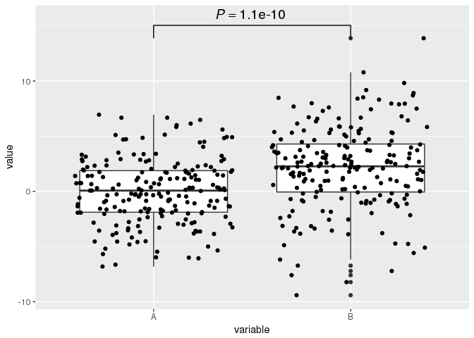
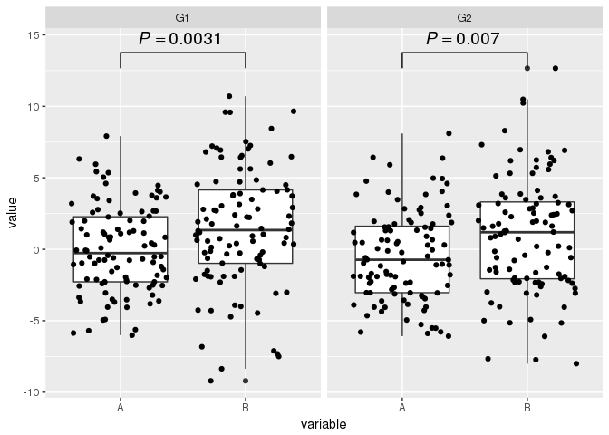
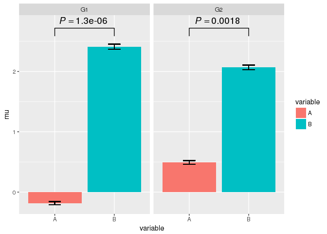

<!-- README.md is generated from README.Rmd. Please edit that file -->
ggpval
======

`ggpval` allows you to perform statistic tests and add the corresponding p-values to ggplots automatically. P-values can be presented numerically or as stars (e.g. \*, \*\*). Alternatively, one can also make any text annotation between groups.

Installation
------------

You can install ggpval from github with:

``` r
# install.packages("devtools")
devtools::install_github("s6juncheng/ggpval")
```

Example
-------

Simulate data with groups.

``` r
library(ggpval)
library(data.table)
library(ggplot2)
A <- rnorm(200, 0, 3)
B <- rnorm(200, 2, 4)
G <- rep(c("G1", "G2"), each = 100)
dt <- data.table(A, B, G)
dt <- melt(dt, id.vars = "G")
```

A trivial boxplot example
-------------------------

Give group pairs you want to compare in `pairs`.

``` r
plt <- ggplot(dt, aes(variable, value)) +
  geom_boxplot() +
  geom_jitter()

add_pval(plt, pairs = list(c(1, 2)))
```



Boxplot with facets
-------------------

``` r
plt <- ggplot(dt, aes(variable, value)) +
  geom_boxplot() +
  geom_jitter() +
  facet_wrap(~G)
add_pval(plt, pairs = list(c(1, 2)))
```



Annotate your plot
------------------

``` r
add_pval(plt, pairs = list(c(1, 2)), annotation = "Awesome")
```



Bugs and issues
---------------

Please report bugs and issues on github issue page: <https://github.com/s6juncheng/ggpval/issues>. Contributions are welcomed.

Acknowledgement
---------------

Thanks to Vicente Yépez for testing and helping with improvement of the package.
