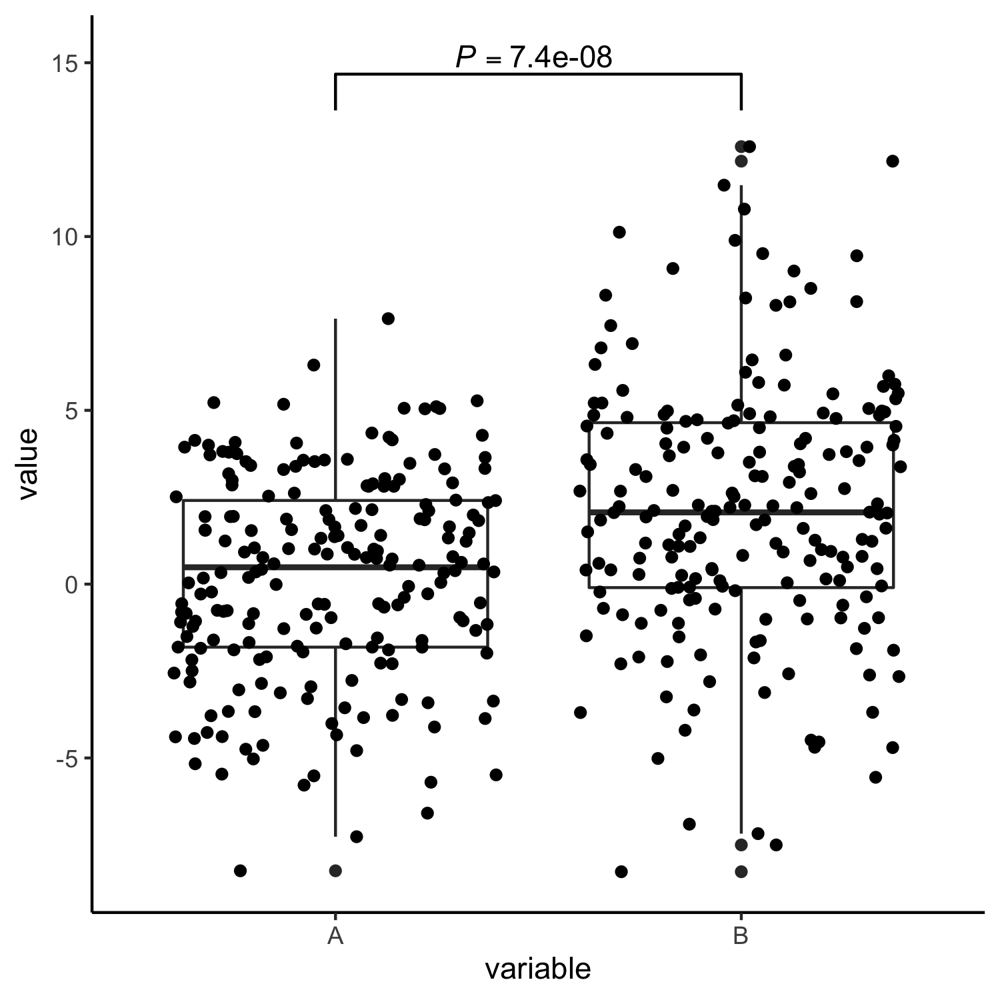
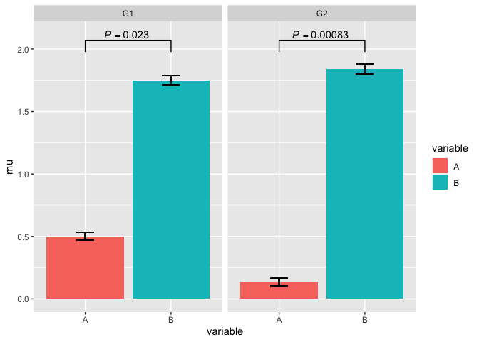
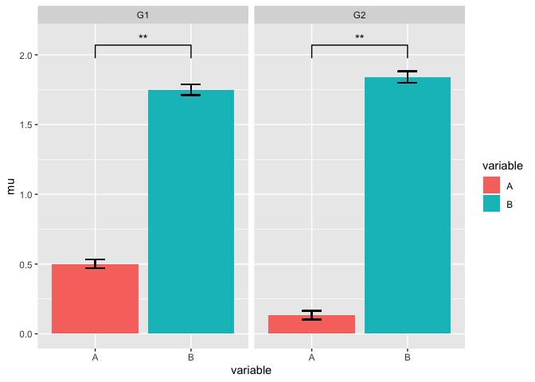
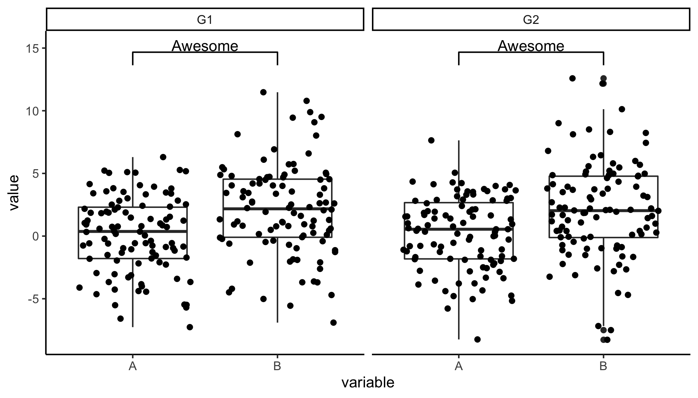
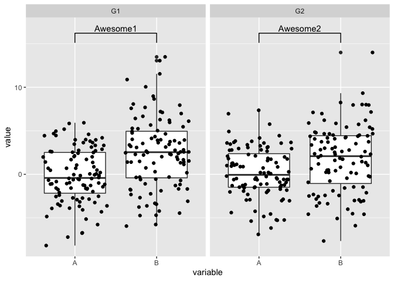

<!-- badges: start --> 
[](https://cran.r-project.org/web/checks/check_results_ggpval.html)
[](https://cran.r-project.org/package=ggpval)
[](https://cran.r-project.org/package=ggpval)
[](https://cran.r-project.org/package=ggpval)
<!-- badges: end -->

<!-- README.md is generated from README.Rmd. Please edit that file -->

ggpval
======

`ggpval` allows you to perform statistic tests and add the corresponding
p-values to ggplots automatically. P-values can be presented numerically
or as stars (e.g. \*, \*\*). Alternatively, one can also make any text
annotation between groups.

Installation
------------

``` r
# Install `ggpval` from CRAN:
install.packages("ggpval")

# You can install the lastest ggpval from github with:
# install.packages("devtools")
devtools::install_github("s6juncheng/ggpval")
```

Example
-------

Simulate data with groups.

``` r
library(ggpval)
library(data.table)
library(ggplot2)
A <- rnorm(200, 0, 3)
B <- rnorm(200, 2, 4)
G <- rep(c("G1", "G2"), each = 100)
dt <- data.table(A, B, G)
dt <- melt(dt, id.vars = "G")
```

A trivial boxplot example
-------------------------

Give the group pairs you want to compare in `pairs`.

``` r
plt <- ggplot(dt, aes(variable, value)) +
  geom_boxplot() +
  geom_jitter()

add_pval(plt, pairs = list(c(1, 2)))
```



Boxplot with facets
-------------------

``` r
plt <- ggplot(dt, aes(variable, value)) +
  geom_boxplot() +
  geom_jitter() +
  facet_wrap(~G)
add_pval(plt, pairs = list(c(1, 2)))
```


Bar plot
--------

`ggpval` tries to infer the column which contains the data to do
statistical testing. In case this inference was wrong or not possible
(for instance the raw data column was not mapped in ggplot object), you
can specify the correct column name with `response=`.

``` r
dt[, mu := mean(value),
   by = c("G", "variable")]

dt[, se := sd(value) / .N,
   by = c("G", "variable")]

plt_bar <- ggplot(dt, aes(x=variable, y=mu, fill = variable)) +
  geom_bar(stat = "identity", position = 'dodge') +
  geom_errorbar(aes(ymin=mu-se, ymax=mu+se),
                width = .2) +
  facet_wrap(~G)

add_pval(plt_bar, pairs = list(c(1, 2)), response = 'value')
```



Additional arguments for statistical function can also be directly
specified. Here we also the conventional "\*" format for significance
level.

``` r
add_pval(plt_bar, pairs = list(c(1, 2)), 
         test = 't.test',
          alternative = "less",
         response = 'value',
         pval_star = T)
```



Annotate your plot
------------------

``` r
add_pval(plt, pairs = list(c(1, 2)), annotation = "Awesome")
```



In case you to want give different annotations to each facets, provide
your annotation as a list

``` r
add_pval(plt, pairs = list(c(1, 2)), annotation = list("Awesome1", "Awesome2"))
```



Bugs and issues
---------------

Please report bugs and issues on github issue page:
<a href="https://github.com/s6juncheng/ggpval/issues" class="uri">https://github.com/s6juncheng/ggpval/issues</a>.
Contributions are welcome.

Acknowledgement
---------------

Thanks to Vicente Yépez for testing and helping with improvement of the
package.
